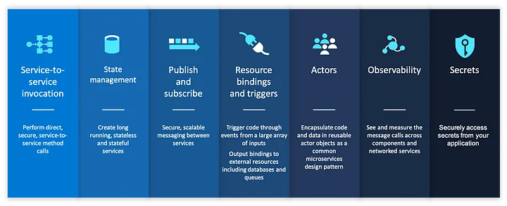

# Laravel Publisher Consumer example using Dapr

### Dapr

Dapr is a portable, event-driven runtime that makes it easy for any developer to build resilient, stateless and stateful applications that run on the cloud and edge and embraces the diversity of languages and developer frameworks. Leveraging the benefits of a sidecar architecture, Dapr helps you tackle the challenges that come with building microservices and keeps your code platform agnostic.



### Laravel Caveats

Dapr [PHP sdk](https://github.com/dapr/php-sdk) does not work with latest version of laravel due dependecy issues.
To solve this we needed a way to work natively with dapr using dapr's internal Api.

### Advantages of using Dapr over laravel queues

 > Dapr is portable

 > Dapr is language agnostic

 > Dapr is platform agnostic

 > Dapr is cloud agnostic

### Solution

The above example provides two services
- Publisher Service: This service will push messages onto dapr topic
- Consumer Service: This service subscribes to the topic used by the publisher service, and route the request as per rules


### Running the example

- install [docker desktop](https://www.docker.com/products/docker-desktop/)

```bash
docker compose up
```

- Make a post request using postman to http://localhost:8088/api/dapr/publish

- Observe the log in consumer app will print the received message

### Dapr config

- To check dapr config for publisher send a post request to http://localhost:3500/v1.0/metadata

- To check dapr config for consumer send a post request to http://localhost:3501/v1.0/metadata
# laravel-dapr
